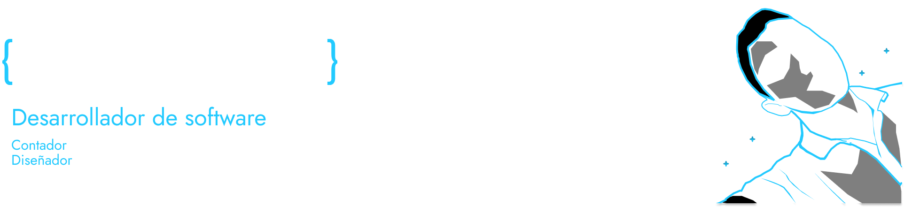

  
  
<!-- # Hi, I am [**Eliseo Arévalo Espinoza**](https://eliseodesign.github.io/) -->
  

frontend developer and a bit of backend

Soy un programador autodidacta y estudiante de la carrera técnica
de ingeniería en desarrollo de software en la Escuela Superior
Franciscana Especializada, con experiencia en el desarrollo web
frontend, con conocimientos también de desarrollo backend,
gestión, control de proyectos como sus versiones.

  

<h3>frontend:</h3>

 
 
<a href="https://www.w3schools.com/css/" target="_blank" rel="noreferrer"> 
 
 

<h3 align="center">backend:</h3>

 
 
 

  
  <h3 align="center">dev Tools </h3>
  

   
    
     
         
  

  
<!-- 
  
   -->
  
 

  
  

