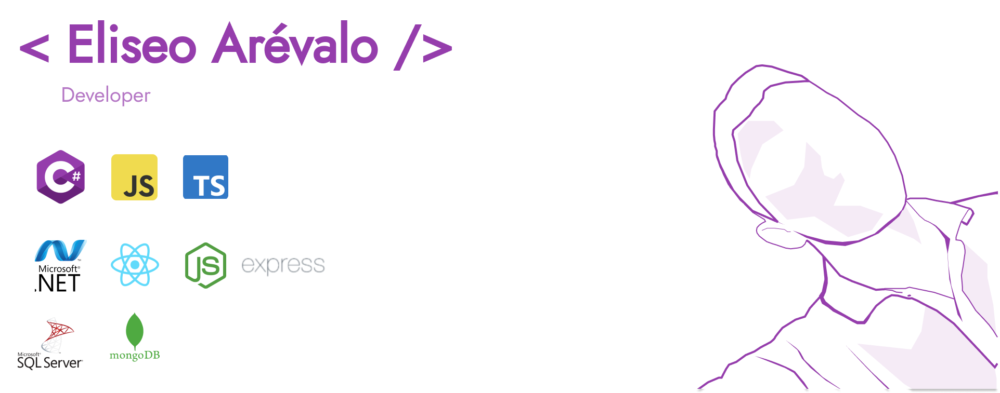

  
  
<!-- # Hi, I am [**Eliseo Arévalo Espinoza**](https://eliseodesign.github.io/) -->
  

[Ver Portafolio web](https://eliseo.netlify.app/)

I'M ELISEO 🤨

Frontend Developer - Learning a bit of backend

I'm a frontend dev, software student in the "Escuela Superior Franciscana"
I've experience in frontend web development, with knowledge also in backend development.

  
<!-- ---- -->

  
  
 
  
|Frontend | Backend |Dev Tools|
| :---: |:---:| :---: |
|<!--F: html -->   | <!--B: Node js--> | <!--T: figma --> | <!--___________________________________________________________________-->
|<!--F: Csss --><a href="https://www.w3schools.com/css/" target="_blank" rel="noreferrer"> |  |<!--T: GIT-->| <!--___________________________________________________________________-->
|<!--F: Sass --> |<!--B:******************* -->|<!--T: Photoshop--> |<!--___________________________________________________________________-->
|<!--F: Taildwin -->|<!-- -->|<!--T: Markdown -->         |<!--___________________________________________________________________-->
| <!-- -->  | | |<!--___________________________________________________________________-->
| <!-- -->  | | |
  
<!--   ------ -->
  
 
<!-- 
  
   -->
  
 

  
  

